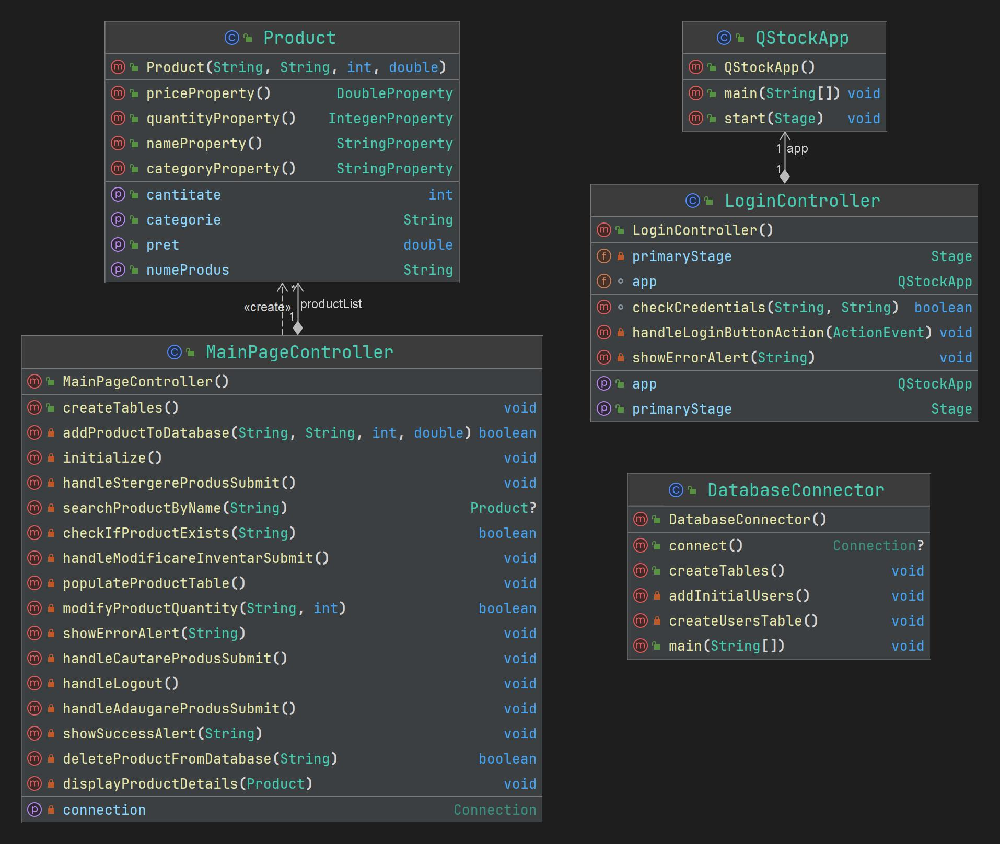

# qStock
### Diaconu Andrei Catalin

## Descriere
Aplicatia qStock este o aplicatie de gestiune a stocurilor unui magazin.
Aplicația permite adaugarea, actualizarea și ștergerea articolelor și cantitatea acestora și căutarea după denumire.
De asemenea utilizatorul poate afișa toate articolele din magazin și să vadă care au o cantitate scazută.
## Obiective

* metoda de logare
* manipularea produselor
* - adaugare produse
* - modificare stoc
* - stergere produse
* cautare produse
* - dupa nume
* afisare produse
* - afisarea tuturor produselor si vizualizarea celor cu cantitatii scazute

## Arhitectura

## Functionalitati/Exemple utilizare
* Adăugarea unui produs în stoc 
* Modificarea stocului
* Ștergerea unui produs din stoc
* Căutarea produselor
* Autentificarea utilizatorilor
* Gestionarea datelor produselor
* Afișarea produselor disponibile
* Gestionarea categoriilor de produse

## Cum utilizăm aplicația

* Pentru a putea utiliza aplicatia trebuie sa hostati un server local cu xampp si sa creati un user cu numele admin si parola 1234 si sa ii dati all Global privileges.
* Aplicatia va crea singura baza de date si tabelele necesare.

### Cum ne logam

* Aplicatia are 2 tipuri de utilizatori: admin si user.
* Adminul are campurile username si parola setate pe admin si adminpass.
* Userul are campurile username si parola setate pe user1 si userpass.
* Asa arata pagina de login:

### Cum adaugam un produs

* Dupa ce ne-am logat, putem adauga un produs.
* Completam campurile si apasam pe butonul submit.
* Asa arata pagina de adaugare a unui produs:

* Dupa ce am adaugat produsul, primim un mesaj de confirmare:

### Cum stergem un produs

* Completam campul cu numele produsului pe care vrem sa il stergem, confirmam numele si apasam pe butonul de stergere.
* Asa arata pagina de stergere a unui produs:

* Dupa ce am sters produsul, primim un mesaj de confirmare:

### Cum modificam stocul unui produs

* Completam campul cu numele produsului pe care vrem sa il modificam, completam campul cu cantitatea noua si apasam pe butonul de submit.
* Asa arata pagina de modificare a stocului unui produs:

* Dupa ce am modificat stocul, primim un mesaj de confirmare:

### Cum cautam un produs

* Completam campul cu numele produsului pe care vrem sa il cautam si apasam pe butonul de cautare.
* Asa arata pagina de cautare a unui produs:

* Dupa ce am cautat produsul, primim pe ecran informatiile despre produs precum numele, categoria, cantitatea, si pretul:

### Cum vizualizam produsele

* Accesam pagina de vizualizare a produselor.
* Asa arata pagina de vizualizare a produselor:

* Pe aceasta pagina putem vedea toate produsele din stoc si putem vedea care au cantitatea scazuta marcata cu rosu.
* Putem sa sortam produsele dupa nume, cantitate, pret si categorie apasand pe campul respectiv.

### Cum ne delogam

* Accesam pagina de delogare.
* Apasam pe butonul de delogare.
* Dupa ce ne-am delogat, vom fi redirectionati catre pagina de login.
* Asa arata pagina de delogare:

### Resurse
Markdown Guide, [Online] Available: https://www.markdownguide.org/basic-syntax/ [accesed: Mar 14, 1706]

